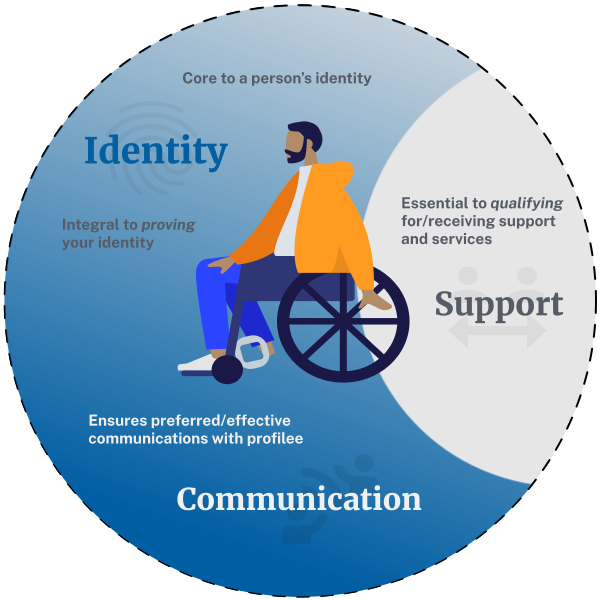

<!-- top section -->
<section class="text-center margin-y-6">
  

    <h2>
      Help users to...{{ page.help_detail }}
    </h2>
  

  
Why this matters?

  
</section>

<!-- section one -->
<section class="together-section">      
  <h2 class="text-center font-sans-2xl text-base-dark text-normal">
    {{ page.section_one.main_heading }}
  </h2>
  

    
  
  
  

    

      
        

          

            <h3 class="together-section__heading">
            {{ item.heading }}
            </h3>
            
{{ item.description | markdownify }}

          

        
  
      
    

  

</section>

<!-- section two and three -->
<section class="together-section">

  

    <h2 class="text-center font-sans-2xl text-base-dark text-normal margin-bottom-10">
      {{ page.section_two.main_heading }}
    </h2>
    

      
    
  
    

      
        

          

            <h3 class="together-section__heading">
            {{ item.heading }}
            </h3>
            
{{ item.description | markdownify }}

          

        
  
      
    

  

  

    <h2 class="text-center font-sans-2xl text-base-dark text-normal margin-bottom-4">
      {{ page.section_three.main_heading }}
    </h2>
    

      
    
  
    

      
        

          

            <h3 class="together-section__heading">
            {{ item.heading }}
            </h3>
            
{{ item.description | markdownify }}

          

        
  
      
    
    
  

      
</section>

<!-- section four -->
<section class="together-section">      
  <h2 class="text-center font-sans-2xl text-base-dark text-normal">
    {{ page.section_four.main_heading }}
  </h2>
  

    
  
  
  

    

      
        

          

            <h3 class="together-section__heading">
            {{ item.heading }}
            </h3>
            
{{ item.description | markdownify }}

          

        
  
      
    

  

</section>